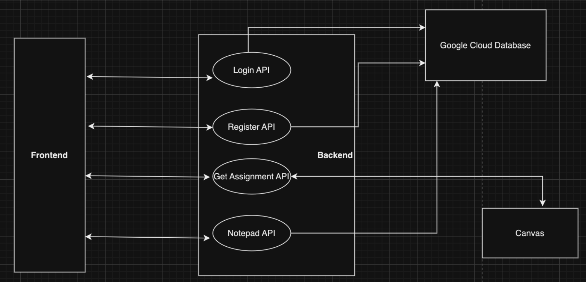

# Introduction

## What is an iReminder?

An iReminder is a Web Application for students to keep track of their assignments and due dates for various courses and from various platforms. In addition, the App provides a Notepad which allows students put personal notes that won’t be lost. We use databases to store user email, password, and their notes.

For more details, view the full project proposal [here](https://docs.google.com/document/d/1sZEiNDRo9mD-cQhwU86gJmU_nhVkkMKbc-axWpiCEWY/edit#heading=h.qougbnz1fcec)

# Technical Architecture



# Developers

- **Xinyi Wei**: Worked on Backend APIs, Frontend styles and Frontend API calls.
- **Lance Tran**: Worked on DB and Notepad Feature
- **Nate Gomes**: Worked on frontend setup, backend to frontend connection
- **Ronit Rout**: Worked on Frontend CSS styling, Frontend API calls for Chart Component

# Environment Setup

## Installation

To install packages, run the following:

navigate into the server folder then

```
pip install -r requirements.txt
```

navigate into client folder then

```
npm install
```

## To Run

Navigate into the server folder and run:

```
python3 server.py
```

To run, navigate into the client folder and run:

```
npm start
```

Note, you must create a Canvas token and paste it in the homepage after logging-in to use our assignment and calendar feature. More info [here](https://kb.iu.edu/d/aaja#:~:text=Log%20into%20Canvas%20and%2C%20on,fill%20out%20all%20required%20information.)

# Project Instruction

We have recorded videos to instruct you on how to use our app:

- [Register & Login](https://drive.google.com/file/d/1QopixejBlKoOQWdTRDvQMA9aZn7zvkY2/view?resourcekey) [& Notepad](https://drive.google.com/file/d/1ZKOgcqnKOKxAlkWlna4sadMTOG-Oyhc0/view?resourcekey)
- [Calendar & Assignment](https://drive.google.com/file/d/1XzjLqauf-4FZ6S45Bzc9FYcoAy3MWI9w/view?resourcekey)
